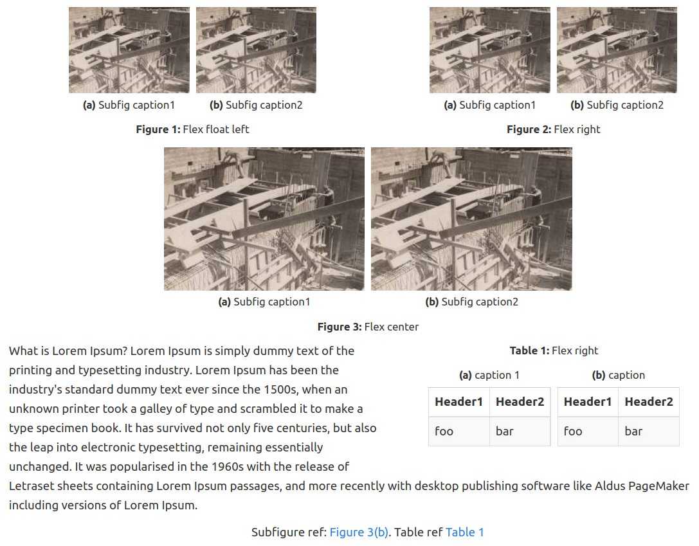

# caption Plugin for DokuWiki

Add figure and table captions

Original fork from Till Biskup and mostly re-written. 
http://till-biskup.de/de/software/dokuwiki/caption


Fixes: 
- No more 'dangerous' string searches to set reference links.
- Change syntax to allow alignment variable (left, center, right, flex(left|center|right)).
- Add ability to have subfigures/tables if your template allows.
- Code easy to expand to caption label more tags if needed.
- Updated some css styles.


Example output:
-------------




New Syntax/ Example:
-------------


```
<figure classes| fig_label>
	<subfigure classes| subfig_label1>
		{{image1.jpg?direct&200}}
		<caption>Subfig caption1</caption>
	</subfigure>
	<subfigure classes| subfig_label2>
		{{image2.jpg?direct&200}}
		<caption>Subfig caption2</caption>
	</subfigure>
	<caption>Main caption</caption>
</figure>
```

Available classes:
------------

 - Alignmet classes: 'left', 'center', 'right', 'flex-left', 'flex-center', 'flex-even', 'flex-right'
 - Caption behaviour: 'cell-bottom', 'cell-top'. This enforces long captions to be no wider than the image/table. Top and bottom refers to position of caption in relation to figure. Most useful to use this with subfigure captions.
 - No colon: 'blank'. Use this if you dont want to print a ':' after the figure number.


Example with centering with caption but no label:

```
<figure flex-center blank>
	{{image1.jpg?direct&200}}
	<caption></caption>
</figure>
```

Example subfigure with a long caption:
```
<figure flex-center>
	<subfigure cell-bottom>
		{{image1.jpg?direct&200}}
		<caption>A really long subfigure caption much longer than the image that needs to wrap</caption>
	</subfigure>
	<subfigure cell-bottom>
		{{image2.jpg?direct&200}}
		<caption>A moderately sized subfigure caption</caption>
	</subfigure>
	<caption>Main caption</caption>
</figure>
```

This gives the output:


In text referencing:
-------------
```
{{ref>label}}
```
Warning: References may render unexpected results if your labels are not unique across all figures, subfigures, tables etc.!

Set counter:
-------------

```
{{setcounter figure=5}}
```

If you install this plugin manually, make sure it is installed in
lib/plugins/caption/ - if the folder is called different it
will not work!

Please refer to http://www.dokuwiki.org/plugins for additional info
on how to install plugins in DokuWiki.

----

Copyright (C) Ben van Magill <ben.vanmagill16@gmail.com>
Copyright (C) Till Biskup <till@till-biskup>

This program is free software; you can redistribute it and/or modify
it under the terms of the GNU General Public License as published by
the Free Software Foundation; version 2 of the License

This program is distributed in the hope that it will be useful,
but WITHOUT ANY WARRANTY; without even the implied warranty of
MERCHANTABILITY or FITNESS FOR A PARTICULAR PURPOSE.  See the
GNU General Public License for more details.

See the LICENSE file in your DokuWiki folder for details
